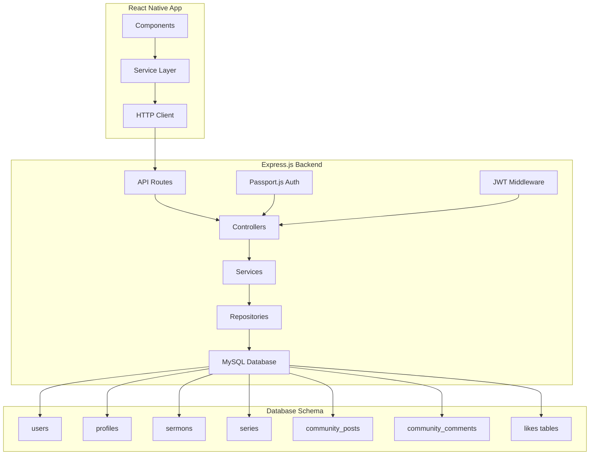

# Design Document

## Overview

This design outlines the migration from Supabase to Express.js/MySQL with Passport.js authentication for the YouPreacher React Native app. The migration maintains all existing functionality while transitioning to a traditional REST API architecture. The frontend service layer will be updated to communicate with Express.js endpoints instead of Supabase, ensuring minimal changes to React Native components.

## Architecture

### High-Level Architecture



### Service Layer Migration Strategy

The existing service files will be updated to call Express.js REST endpoints instead of Supabase:

- `supabaseAuthService.ts` → `expressAuthService.ts`
- `supabaseSermonService.ts` → `expressSermonService.ts`
- `supabaseSeriesService.ts` → `expressSeriesService.ts`
- `supabaseCommunityService.ts` → `expressCommunityService.ts`

## Components and Interfaces

### Authentication Service Interface

```typescript
interface AuthService {
  // Core authentication methods
  isAuthenticated(): Promise<boolean>
  getUser(): Promise<User | null>
  signup(data: SignupData): Promise<AuthResponse>
  signin(data: LoginData): Promise<AuthResponse>
  signout(): Promise<void>
  forgotPassword(email: string): Promise<void>
  
  // Profile management
  updateProfile(updates: Partial<User>): Promise<User>
  getCurrentUser(): Promise<User>
  getPastorProfile(): Promise<any>
  
  // HTTP client helper
  makeAuthenticatedRequest(endpoint: string, options?: RequestInit): Promise<Response>
}
```

### Express.js API Endpoints

#### Authentication Endpoints
- `POST /api/auth/register` - User registration
- `POST /api/auth/login` - User login
- `POST /api/auth/logout` - User logout
- `POST /api/auth/forgot-password` - Password reset request
- `POST /api/auth/reset-password` - Password reset confirmation
- `GET /api/auth/me` - Get current user
- `PUT /api/auth/profile` - Update user profile

#### Sermon Endpoints
- `GET /api/sermons` - List user's sermons
- `GET /api/sermons/:id` - Get specific sermon
- `POST /api/sermons` - Create new sermon
- `PUT /api/sermons/:id` - Update sermon
- `DELETE /api/sermons/:id` - Soft delete sermon

#### Series Endpoints
- `GET /api/series` - List user's series
- `GET /api/series/:id` - Get specific series with sermons
- `POST /api/series` - Create new series
- `PUT /api/series/:id` - Update series
- `DELETE /api/series/:id` - Soft delete series
- `GET /api/series/active` - Get active series

#### Community Endpoints
- `GET /api/community/posts` - List community posts
- `GET /api/community/posts/:id` - Get specific post
- `POST /api/community/posts` - Create new post
- `PUT /api/community/posts/:id` - Update post
- `DELETE /api/community/posts/:id` - Delete post
- `POST /api/community/posts/:id/like` - Toggle post like
- `GET /api/community/posts/:id/comments` - Get post comments
- `POST /api/community/posts/:id/comments` - Create comment
- `POST /api/community/comments/:id/like` - Toggle comment like
- `GET /api/community/my-posts` - Get user's posts

## Data Models

### MySQL Database Schema

#### Users Table
```sql
CREATE TABLE users (
  id VARCHAR(36) PRIMARY KEY DEFAULT (UUID()),
  email VARCHAR(255) UNIQUE NOT NULL,
  password_hash VARCHAR(255) NOT NULL,
  username VARCHAR(100) UNIQUE NOT NULL,
  email_confirmed BOOLEAN DEFAULT FALSE,
  blocked BOOLEAN DEFAULT FALSE,
  created_at TIMESTAMP DEFAULT CURRENT_TIMESTAMP,
  updated_at TIMESTAMP DEFAULT CURRENT_TIMESTAMP ON UPDATE CURRENT_TIMESTAMP,
  deleted_at TIMESTAMP NULL,
  INDEX idx_email (email),
  INDEX idx_username (username)
);
```

#### Profiles Table
```sql
CREATE TABLE profiles (
  id VARCHAR(36) PRIMARY KEY,
  full_name VARCHAR(255),
  title VARCHAR(100),
  church VARCHAR(255),
  created_at TIMESTAMP DEFAULT CURRENT_TIMESTAMP,
  updated_at TIMESTAMP DEFAULT CURRENT_TIMESTAMP ON UPDATE CURRENT_TIMESTAMP,
  FOREIGN KEY (id) REFERENCES users(id) ON DELETE CASCADE
);
```

#### Series Table
```sql
CREATE TABLE series (
  id VARCHAR(36) PRIMARY KEY DEFAULT (UUID()),
  user_id VARCHAR(36) NOT NULL,
  title VARCHAR(255) NOT NULL,
  description TEXT,
  start_date DATE,
  end_date DATE,
  image_url VARCHAR(500),
  tags JSON,
  status ENUM('planning', 'active', 'completed', 'archived') DEFAULT 'planning',
  created_at TIMESTAMP DEFAULT CURRENT_TIMESTAMP,
  updated_at TIMESTAMP DEFAULT CURRENT_TIMESTAMP ON UPDATE CURRENT_TIMESTAMP,
  deleted_at TIMESTAMP NULL,
  FOREIGN KEY (user_id) REFERENCES users(id) ON DELETE CASCADE,
  INDEX idx_user_id (user_id),
  INDEX idx_status (status)
);
```

#### Sermons Table
```sql
CREATE TABLE sermons (
  id VARCHAR(36) PRIMARY KEY DEFAULT (UUID()),
  user_id VARCHAR(36) NOT NULL,
  series_id VARCHAR(36),
  title VARCHAR(255) NOT NULL,
  content LONGTEXT,
  outline JSON,
  scripture TEXT,
  tags JSON,
  status ENUM('draft', 'preparing', 'ready', 'delivered', 'archived') DEFAULT 'draft',
  visibility ENUM('private', 'congregation', 'public') DEFAULT 'private',
  date DATETIME,
  notes TEXT,
  duration INT,
  audio_url VARCHAR(500),
  video_url VARCHAR(500),
  created_at TIMESTAMP DEFAULT CURRENT_TIMESTAMP,
  updated_at TIMESTAMP DEFAULT CURRENT_TIMESTAMP ON UPDATE CURRENT_TIMESTAMP,
  deleted_at TIMESTAMP NULL,
  FOREIGN KEY (user_id) REFERENCES users(id) ON DELETE CASCADE,
  FOREIGN KEY (series_id) REFERENCES series(id) ON DELETE SET NULL,
  INDEX idx_user_id (user_id),
  INDEX idx_series_id (series_id),
  INDEX idx_status (status)
);
```

#### Community Posts Table
```sql
CREATE TABLE community_posts (
  id VARCHAR(36) PRIMARY KEY DEFAULT (UUID()),
  author_id VARCHAR(36) NOT NULL,
  title VARCHAR(255) NOT NULL,
  content LONGTEXT NOT NULL,
  tags JSON,
  visibility ENUM('community', 'public', 'private') DEFAULT 'community',
  status ENUM('active', 'archived', 'draft') DEFAULT 'active',
  created_at TIMESTAMP DEFAULT CURRENT_TIMESTAMP,
  updated_at TIMESTAMP DEFAULT CURRENT_TIMESTAMP ON UPDATE CURRENT_TIMESTAMP,
  FOREIGN KEY (author_id) REFERENCES users(id) ON DELETE CASCADE,
  INDEX idx_author_id (author_id),
  INDEX idx_status (status),
  INDEX idx_visibility (visibility)
);
```

#### Community Comments Table
```sql
CREATE TABLE community_post_comments (
  id VARCHAR(36) PRIMARY KEY DEFAULT (UUID()),
  post_id VARCHAR(36) NOT NULL,
  author_id VARCHAR(36) NOT NULL,
  parent_comment_id VARCHAR(36),
  content TEXT NOT NULL,
  created_at TIMESTAMP DEFAULT CURRENT_TIMESTAMP,
  updated_at TIMESTAMP DEFAULT CURRENT_TIMESTAMP ON UPDATE CURRENT_TIMESTAMP,
  FOREIGN KEY (post_id) REFERENCES community_posts(id) ON DELETE CASCADE,
  FOREIGN KEY (author_id) REFERENCES users(id) ON DELETE CASCADE,
  FOREIGN KEY (parent_comment_id) REFERENCES community_post_comments(id) ON DELETE CASCADE,
  INDEX idx_post_id (post_id),
  INDEX idx_author_id (author_id)
);
```

#### Likes Tables
```sql
CREATE TABLE community_post_likes (
  id VARCHAR(36) PRIMARY KEY DEFAULT (UUID()),
  post_id VARCHAR(36) NOT NULL,
  user_id VARCHAR(36) NOT NULL,
  created_at TIMESTAMP DEFAULT CURRENT_TIMESTAMP,
  UNIQUE KEY unique_post_like (post_id, user_id),
  FOREIGN KEY (post_id) REFERENCES community_posts(id) ON DELETE CASCADE,
  FOREIGN KEY (user_id) REFERENCES users(id) ON DELETE CASCADE
);

CREATE TABLE community_comment_likes (
  id VARCHAR(36) PRIMARY KEY DEFAULT (UUID()),
  comment_id VARCHAR(36) NOT NULL,
  user_id VARCHAR(36) NOT NULL,
  created_at TIMESTAMP DEFAULT CURRENT_TIMESTAMP,
  UNIQUE KEY unique_comment_like (comment_id, user_id),
  FOREIGN KEY (comment_id) REFERENCES community_post_comments(id) ON DELETE CASCADE,
  FOREIGN KEY (user_id) REFERENCES users(id) ON DELETE CASCADE
);
```

### Express.js Application Structure

```
src/
├── app.js                 # Express app setup
├── config/
│   ├── database.js        # MySQL connection config
│   ├── passport.js        # Passport.js configuration
│   └── jwt.js            # JWT configuration
├── controllers/
│   ├── authController.js
│   ├── sermonController.js
│   ├── seriesController.js
│   └── communityController.js
├── middleware/
│   ├── auth.js           # JWT authentication middleware
│   ├── validation.js     # Request validation
│   └── errorHandler.js   # Global error handling
├── models/
│   ├── User.js
│   ├── Profile.js
│   ├── Sermon.js
│   ├── Series.js
│   └── CommunityPost.js
├── routes/
│   ├── auth.js
│   ├── sermons.js
│   ├── series.js
│   └── community.js
├── services/
│   ├── authService.js
│   ├── sermonService.js
│   ├── seriesService.js
│   └── communityService.js
└── utils/
    ├── logger.js
    ├── validators.js
    └── helpers.js
```

## Error Handling

### Error Response Format
All API endpoints will return consistent error responses:

```typescript
interface ErrorResponse {
  success: false
  error: {
    code: string
    message: string
    details?: any
  }
  timestamp: string
}
```

### Success Response Format
```typescript
interface SuccessResponse<T> {
  success: true
  data: T
  timestamp: string
}
```

### HTTP Status Codes
- `200` - Success
- `201` - Created
- `400` - Bad Request (validation errors)
- `401` - Unauthorized (authentication required)
- `403` - Forbidden (insufficient permissions)
- `404` - Not Found
- `409` - Conflict (duplicate data)
- `429` - Too Many Requests (rate limiting)
- `500` - Internal Server Error

## Testing Strategy

### Unit Testing
- Test all service methods with mock data
- Test authentication middleware
- Test validation functions
- Test database models and queries

### Integration Testing
- Test complete API endpoints
- Test database operations
- Test authentication flows
- Test error handling scenarios

### Migration Testing
- Test data migration scripts
- Verify data integrity after migration
- Test service layer compatibility
- Test frontend integration with new endpoints

### Performance Testing
- Load testing for API endpoints
- Database query optimization
- Response time benchmarks
- Memory usage monitoring

## Security Considerations

### Authentication Security
- JWT tokens with appropriate expiration times
- Secure password hashing using bcrypt
- Rate limiting on authentication endpoints
- Account lockout after failed attempts

### API Security
- Input validation and sanitization
- SQL injection prevention using parameterized queries
- CORS configuration for React Native app
- Request size limits
- API rate limiting

### Database Security
- Connection encryption
- Principle of least privilege for database users
- Regular security updates
- Backup encryption

## Migration Strategy

### Phase 1: Backend Setup
1. Set up Express.js application structure
2. Configure MySQL database and create schema
3. Implement Passport.js authentication
4. Create API endpoints with proper validation

### Phase 2: Service Layer Migration
1. Create new Express.js service files
2. Update HTTP client configuration
3. Implement error handling and response parsing
4. Add authentication token management

### Phase 3: Testing and Validation
1. Unit test all new services
2. Integration test API endpoints
3. Test frontend compatibility
4. Performance testing and optimization

### Phase 4: Data Migration
1. Export data from Supabase
2. Transform data to MySQL format
3. Import data with proper relationships
4. Verify data integrity

### Phase 5: Deployment
1. Deploy Express.js backend
2. Update React Native app configuration
3. Monitor for issues and performance
4. Gradual rollout with rollback plan